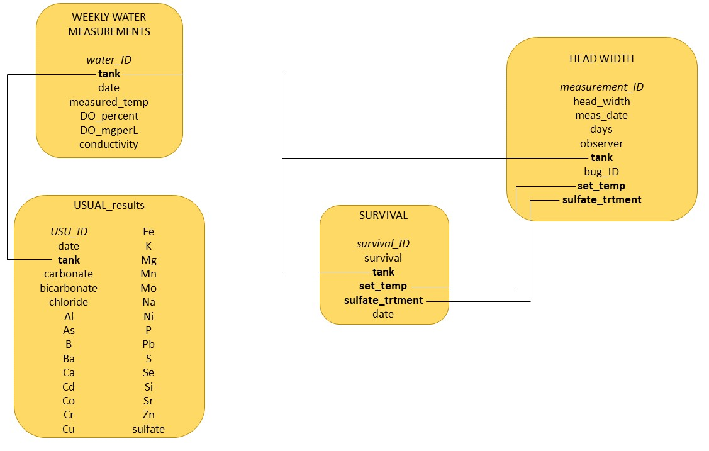

--- 
title: "WILD6900: Reproducible Science Project"
author: "Katy Gardner"
date: "`r Sys.Date()`"
site: bookdown::bookdown_site
documentclass: book
bibliography: [book.bib, packages.bib]
biblio-style: apalike
link-citations: yes
description: "This is the bookdown file desrcibing the process I am taking in constructing my final project for WILD6900: Reproducible Science, a graduate course at Utah State University."
---

# Introduction

For my final project, I will use data collected during long-term laboratory experiments I am running for my dissertation. Data collected during these experiments include: survivorship data, growth data, water chemistry, and water quality measurements. Overall, these experiments are designed to investigate the effects of salinity and temperature on aquatic insect growth and survival. The data used in this project are from my first experiment, in which I exposed *Pteronarcys californica* nymphs (the giant salmonfly) to 6 sulfate concentration treatments across 6 temperature treatments, for a total of 36 exposure treatments.

## Project Goals
In this project, I will:

1. clean and manage the data I have collected for this experiment
2. create a database structure that can also be used in future experiments
3. generate a fitness index
4. visually inspect collected data for treatment effects on 
    i) survival and 
    ii) fitness index

## Project Outline 

Chapter \@ref(database) details the process of creating an RSQLite database in RMarkdown and importing all project data (mentioned above: survivorship, growth, water quality and water chemistry) into this database.

Chapter \@ref(survival) visually inspects the survival data for trends in % survival in response to either the sulfate or temperature treatments.

Chapter \@ref(fitness) generates a fitness index using the survival and growth data from our database, and uses the fitness index data in plots to visualize the effects of temperature and sulfate treatments on *Pteronarcys* fitness.

<!--chapter:end:index.Rmd-->


# Building my SQLite database {#database}

```{r, warning=FALSE, message=FALSE}

#load packages
library(DBI)
library(RSQLite)
library(dplyr)
library(tidyverse)
library(lessR)
library(tibble)

```

For my project, I have 4 main .csv files that I want to incorporate into one database. The files pertain to two main entities: the tanks and the bugs. Tanks contain bugs in certain treatment conditions (temperature and added sulfate). There are 3 sampling processes going on: tanks, bugs, and chemical analyses. Chemical analyses are conducted prior to the start of the experiment and at the end of the experiment. Tanks are measured approximately twice a week (with some variability) for dissolved oxygen, conductivity, and temperature levels as a sort of maintenance measurement. The number of bugs alive per tank is measured once a week and recorded as that tank's survival. Finally, bugs are measured once every two weeks for head capsule width, which can then be converted to a specific growth measurement. The database structure I intend to follow is displayed below.

```{r image, echo = FALSE, fig.align = "center", fig.cap="Database structure. Italics denote primary key, bold denotes foreign keys.", out.width='100%'}

```

## USUAL water data

First, I will create a database connection in the "project" folder of my Reproducible Science class folder.
```{r}

#establish a database connection
ptery_sulf_db <- dbConnect(drv = RSQLite::SQLite(), 
                        "../raw_data/ptery_sulf.db")

```

Next, I want to load in all of the .csv files I intend to add to the database. I'll start with USUAL water measurement data.
```{r}

USUAL_start <- read.csv("../raw_data/2020-07_USUAL_results.csv")
USUAL_end <- read.csv("../raw_data/2021-01_USUAL_results.csv")
#original USUAL docs had "<" when measurement values were below detection limits (typically <0.001)
#I replaced "<" with empty cells for R purposes. Not sure if empty/blank cells are more appropriate than 0's?
```

We want to combine these two USUAL .csv files into one for the database. Some cleaning needs to be done before merging the two files. Additionally, carbonate and bicarbonate were only measured in the second round of tests ("end"), so these columns will need to be added to the first document.

```{r}
USUAL_start <- USUAL_start %>%
  rename(USU_ID = ï..USU_ID,
         Sulfate = Sulfate.Sulfur,
         arsenic = As) #renaming columns that imported into R poorly

USUAL_start <- USUAL_start[1:37, ] #deleting empty rows that were for some reason included in the csv import

USUAL_start <- add_column(USUAL_start, date = rep(as.Date("2020-07-27"),37), .after = 1) #add in date of water sample to differentiate between start and end

USUAL_end <- USUAL_end %>%
  rename(USU_ID = ï..USU_ID,
         Sulfate = Sulfate.Sulfur,
         arsenic = As, #for some reason RSQLite won't create table with this column name as As
         carbonate = Carbonate_mmolc.L,
         bicarbonate = Bicarbonate_mmolc.L) #the "." in the original name not SQL friendly

USUAL_end <- USUAL_end[1:36, ] #USUAL_end has one fewer rows because we did not test the well water a second time

USUAL_end <- add_column(USUAL_end, date = rep(as.Date("2021-01-07"),36), .after = 1)

empty_cols <- c("carbonate", "bicarbonate") #adding empty columns before vertically merging
USUAL_start[, empty_cols] <- NA

#merge files vertically
usual <- Merge(USUAL_start, USUAL_end, by="rows")

```

Let's add the USUAL dataframe into our database.

```{r, eval=FALSE}
#write table in database
dbExecute(ptery_sulf_db, "CREATE TABLE usual (
          USU_ID float NOT NULL PRIMARY KEY,
          date text,
          Trough integer,
          Tank integer,
          Chloride float, 
          Al float,
          arsenic float,
          B float,
          Ba float,
          Ca float,
          Cd float,
          Co float,
          Cr float,
          Cu float,
          Fe float,
          K float,
          Mg float,
          Mn float,
          Mo float,
          Na float,
          Ni float,
          P float,
          Pb float,
          S float,
          Se float,
          Si float,
          Sr float,
          Zn float,
          Sulfate float,
          carbonate float,
          bicarbonate float);")

dbWriteTable(ptery_sulf_db, "usual", usual, append = TRUE)
dbListTables(ptery_sulf_db) 
```

With the table added, let's check to see that it worked before moving on to the other 3 tables.

```{r}


dbGetQuery(ptery_sulf_db, "SELECT * FROM usual LIMIT 10;")

```

Sweet! It worked! Adding the other .csv files next.

## Survival data

```{r}
survival.wide <- read.csv("../raw_data/weekly_survival.csv")

#this file is in wide form, let's switch it to a more r-friendly long-form

survival <- gather(survival.wide, sdate, survival, na.rm = F, X28.Jul:X28.Dec)


survival$Sulfate.mg.L <- as.character(survival$Sulfate.mg.L)

survival <- survival %>%
  mutate(sdate2 = dplyr::recode(sdate,                     # note use of dplyr::
                                X28.Jul  = "2020-07-28",
                                X3.Aug = "2020-08-03",
                                X10.Aug = "2020-08-10",
                                X17.Aug = "2020-08-17",
                                X24.Aug = "2020-08-24",
                                X31.Aug = "2020-08-31",
                                X8.Sep = "2020-09-08",
                                X14.Sep = "2020-09-14",
                                X21.Sep = "2020-09-21",
                                X28.Sep = "2020-09-28",
                                X5.Oct = "2020-10-05",
                                X12.Oct = "2020-10-12",
                                X19.Oct = "2020-10-19",
                                X26.Oct = "2020-10-26",
                                X2.Nov = "2020-11-02",
                                X9.Nov = "2020-11-09",
                                X16.Nov = "2020-11-16",
                                X23.Nov = "2020-11-23",
                                X30.Nov = "2020-11-30",
                                X7.Dec = "2020-12-07",
                                X14.Dec = "2020-12-14",
                                X21.Dec = "2020-12-21",
                                X28.Dec = "2020-12-28"))


with(survival, table(sdate2, sdate)) # a check to make sure therer are 36 values at each old date and recoded date

survival <- survival %>%
  rename(sulfate_trtment = Sulfate.mg.L,
         date = sdate2,
         set_temp = Temperature,
         tank = Tank) #renaming columns that imported into R poorly

survival <- survival[,c(2:4,6:7)]

survival$survival_ID <- 1:nrow(survival) #add a serial no. column to act as unique primary key

survival <- survival[, c("survival_ID", "date", "tank", "set_temp", "sulfate_trtment", "survival")] #reordering columns

```

Write the survival table into database.
```{r, eval=FALSE}
dbExecute(ptery_sulf_db, "CREATE TABLE survival (
          survival_ID integer NOT NULL PRIMARY KEY,
          date text,
          tank integer,
          set_temp integer,
          sulfate_trtment integer, 
          survival integer,
          FOREIGN KEY(tank) REFERENCES usual(tank));")

dbWriteTable(ptery_sulf_db, "survival", survival, append = TRUE)
dbListTables(ptery_sulf_db)
```

```{r}
 
dbGetQuery(ptery_sulf_db, "SELECT * FROM survival LIMIT 10;")

```


## Weekly water measurements
Add weekly water measurement data. NOTE: This data has not all been entered yet, so this data file is really incomplete. Will need to go back and re-add to database when all data has been entered.

```{r}

water_meas <- read.csv("../raw_data/weekly_water_measurements.csv")

#rename some columns
water_meas <- water_meas %>%
  rename(date = ï..DATE,
         measured_temp = TEMP..C.,
         DO_percent = DO.,
         DO_mgL = DO..mg.L.,
         conductivity = CONDUCTIVITY,
         tank = TANK)

#add a serial no. column to act as unique primary key, put it as first column
water_meas <- add_column(water_meas, water_ID = 1:nrow(water_meas), .after = 0)

```

Create water_measures table in SQLite.

```{r, eval=FALSE}
dbExecute(ptery_sulf_db, "CREATE TABLE water_measures (
          water_ID integer NOT NULL PRIMARY KEY,
          date text,
          tank integer,
          measured_temp float,
          DO_percent float, 
          DO_mgL float,
          conductivity integer,
          FOREIGN KEY(tank) REFERENCES survival(tank));")

dbWriteTable(ptery_sulf_db, "water_measures", water_meas, append = TRUE)
dbListTables(ptery_sulf_db) 
```

```{r}
dbGetQuery(ptery_sulf_db, "SELECT * FROM water_measures LIMIT 10;")

```


## Head widths
Import head width data.

```{r}
head_width <- read.csv("../raw_data/head-width_measurements.csv")

#rename some columns
head_width <- head_width %>%
  rename(meas_date = DATE,
         week = WEEK,
         observer = MEASURED_BY,
         bug_ID = ID,
         tank = TANK,
         head_width = HEAD_WIDTH)

#add a serial no. column to act as unique primary key, put it as first column
head_width <- add_column(head_width, meas_ID = 1:nrow(head_width), .after = 0)

#eliminate the "ZOOM" and "MICROMETER UNITS" columns (not needed for db)
head_width <- head_width[,c(1:4, 6:7,10)]
```

Create head_width table in SQLite.

```{r, eval=FALSE}
dbExecute(ptery_sulf_db, "CREATE TABLE head_width (
          meas_ID integer NOT NULL PRIMARY KEY,
          week integer,
          meas_date text,
          observer text,
          tank integer,
          bug_ID varchar(4),
          head_width float,
          FOREIGN KEY(tank) REFERENCES survival(tank));")

dbWriteTable(ptery_sulf_db, "head_width", head_width, append = TRUE)
dbListTables(ptery_sulf_db) 
```

```{r}
dbGetQuery(ptery_sulf_db, "SELECT * FROM head_width LIMIT 10;")

```

<!--chapter:end:01-database.Rmd-->

# Survival {#survival}

## Load in data
Now that the data are loaded into the database, let's look at how survival in each group was affected by the treatments.

```{r, warning=FALSE, message=FALSE, echo=FALSE}

#load packages
library(ggplot2)
library(viridis)
library(viridisLite)
library(dplyr)
library(plotly)
library(ggpubr)
library(tidyr)
library(DBI)

#Connect to project database
ptery_sulf_db <- dbConnect(drv = RSQLite::SQLite(), 
                        "../raw_data/ptery_sulf.db")

```

Load in survival data from database and add column to mutate dates into days for plot simplicity.
```{r}
# get data from ptery_sulf_db database
surv <- dbGetQuery(ptery_sulf_db, "SELECT * FROM survival;")  

# create sampling_date (date class) from date (character class)----
surv <- surv %>%
  mutate(sampling_date = lubridate::ymd(date)) 

#create days column
surv <- surv %>%
  mutate(days = sampling_date - as.Date("2020-07-28"))

surv <- surv[,c(3:6, 8)]
```

## Plots
Plot survival over time (days) by sulfate treatment.
```{r}
#total by treatment, regardless of temperature
surv_trtment <- surv[,c(3:5)]
surv_trtment <- aggregate(. ~sulfate_trtment+days, data = surv_trtment, sum)
surv_trtment$survival <- (((surv_trtment$survival)/60)*100)

surv_trtment$sulfate_trtment <- as.factor(surv_trtment$sulfate_trtment)

#survival plot by sulfate trtment over time
ggplot(surv_trtment, aes(x=days, y=survival, color=sulfate_trtment)) +
  geom_line(lwd = 1.3) +
  theme_bw() +
  labs(x = "Sampling Date (days)", y = "% Survival", color = "Sulfate (mg/L)") +
  theme(legend.position = c(0.01, 0.01),
        legend.justification = c("left", "bottom"),
        legend.background = element_blank(),
        legend.title = element_text(size=11),
        legend.text = element_text(size=11),
        legend.key.size = unit(1, "cm")) +
  scale_y_continuous(limits = c(0,100)) +
  scale_color_viridis_d() 
```


Plot survival over time (days) by temperature treatment.
```{r}
#total by temperature, regardless of treatment
surv_temp <- surv[,c(2,4:5)]
surv_temp <- aggregate(. ~set_temp+days, data = surv_temp, sum)
surv_temp$survival <- (((surv_temp$survival)/60)*100)

surv_temp$set_temp <- as.factor(surv_temp$set_temp)

#survival plot by temperature over time
ggplot(surv_temp, aes(x=days, y=survival, color=set_temp)) +
  geom_line(lwd = 1.3) +
  theme_bw() +
  labs(x = "Sampling Date (days)", y = "% Survival", color = "Temperature (°C)") +
  theme(legend.position = c(0.01, 0.01),
        legend.justification = c("left", "bottom"),
        legend.background = element_blank(),
        legend.title = element_text(size=11),
        legend.text = element_text(size=11),
        legend.key.size = unit(1, "cm")) +
  scale_y_continuous(limits = c(0,100)) +
  scale_color_viridis_d() 
```

Generate barplots of survival at end of experiment per group.
```{r}
####barplots of final survival
#sulfate
sulf_final <- subset(surv_trtment, days == 153)
ggplot(sulf_final, aes(x=sulfate_trtment, y=survival, color=sulfate_trtment, fill=sulfate_trtment)) +
  geom_bar(position="dodge", stat="identity") +
  theme_bw() +
  scale_color_viridis_d() +
  scale_fill_viridis_d() +
  labs(x = "Sulfate (mg/L)", y = "% Survival", title = "% Survival Grouped by Sulfate Treatment") +
  theme(legend.position = "none") +
  scale_y_continuous(limits = c(0,100))

#temp
temp_final <- subset(surv_temp, days == 153)
ggplot(temp_final, aes(x=set_temp, y=survival, color=set_temp, fill=set_temp)) +
  geom_bar(position="dodge", stat="identity") +
  theme_bw() +
  scale_color_viridis_d() +
  scale_fill_viridis_d() +
  labs(x = "Temperature (°C)", y = "% Survival", title = "% Survival Grouped by Temperature Treatment") +
  theme(legend.position = "none") +
  scale_y_continuous(limits = c(0,100))
```

There don't seem to be any visible trends across treatments for % survival, whether that be over time or final. However, survival is only one piece of the overall fitness puzzle we're looking at. In the next section of this project, we will generate a fitness index combining the survival data and growth data to see how overall *Pteronarcys* fitness was affected by these treatements. 

<!--chapter:end:02-survival.Rmd-->


# Fitness index {#fitness}

We are ultimately interested in how overall organism fitness is impacted by sulfate levels. We can better visualize that through a fitness index that combines survival and growth measurements. The fitness index is calculated by multiplying percent survival by the average growth rate (G) for each treatment.

```{r, warning=FALSE, message=FALSE, echo=FALSE}

#load packages
library(DBI)
library(RSQLite)
library(tidyverse)
library(lessR)
library(tibble)
library(plotly)

#Connect to project database
ptery_sulf_db <- dbConnect(drv = RSQLite::SQLite(), 
                        "../raw_data/ptery_sulf.db")

```

## Generate fitness index
To generate our fitness index, we first need to source the data we're interested in from our database `ptery_sulf_db` (Chapter \@ref(database)). We will be using data from the `head_width` and `survival` tables, but only grabbing data for bugs who survived until the end of the experiment (week 22). We will also be omitting the first week of measurement data in `head_width` due to issues with observer error.

```{r}
# only select head width information of individuals that were alive on 2nd measurement day and last
hw_survivors <- dbGetQuery(ptery_sulf_db, "SELECT *
                                            FROM (SELECT *          
                                                  FROM head_width
                                                  WHERE bug_id IN(
                                                      SELECT bug_id
                                                      FROM head_width
                                                      GROUP BY bug_id
                                                      HAVING COUNT(DISTINCT meas_id) = 12))
                                            WHERE (week = 2) OR (week = 22);") 
#nested inquiry isolates individuals alive on all dates
#WHERE statement selects only the data from last first and last measurement dates


end_survival <- dbGetQuery(ptery_sulf_db, "SELECT *
                                           FROM survival
                                           WHERE date = '2020-12-28';")
sum(end_survival$survival)  
```
Output should read 240, which is the number of individuals alive in the last measurement date out of 360.

Next, we will calculate the growth rate for each individual using the specific growth rate (G) equation.
```{r}
hw_survivors <- hw_survivors[,c(2,5:7)]
hw_survivors <- spread(hw_survivors, week, head_width)

hw_survivors <- hw_survivors %>% 
  dplyr:: rename(init = 3, final = 4) %>% 
  mutate(ln = log(final/init), G = (ln/140)*100 ) #140 days between 08/10 and 12/28

#average growth rate for each tank
tank_fit <- aggregate(hw_survivors[,6], list(hw_survivors$tank), mean)
tank_fit <- tank_fit %>%
  dplyr::rename(tank = Group.1, avg_G = x)
```

To calculate the fitness index, we want survival to be represented as the proportion of individuals alive out of 10.
```{r}
#change survival numbers to proportions
end_survival <- end_survival %>% 
  mutate(surv_prop = survival/10)
```

Finally, we will use the specific growth rate (G) data and the survival data to create our fitness index for each tank.
```{r}
#create fitness index 
tank_fit <- tank_fit %>% 
  mutate(surv_prop = end_survival$surv_prop,
         fit_index = (surv_prop*avg_G),
         temp = end_survival$set_temp,
         trtment = end_survival$sulfate_trtment)
###NOTE: first, third, fourth line of mutate code only worked well bc tanks were in order in both df's
###would need to recode to include some "by group" argument to get to work otherwise

```


## Data visualization
### 3D Surface plot

```{r}
prep <- tank_fit[order(tank_fit$trtment),] #reordering survival.wide by sulfate level
prep1 <- prep[order(prep$temp),] #now reordering by temperature

#you want the reordering steps so that you can predictably label the z matrix w/ temp and sulfate 
#column/row names. the original survival.wide had treatments in no particular order
temp <- seq(12, 22, 2) #setting up matrix colnames
sulf <- seq(0, 1000, 200) #rownames

z <- matrix(prep1$fit_index, 6, 6) #reformatting 36 survival data points into matrix, by treatment

rownames(z) <- sulf
colnames(z) <- temp

surf_fit <- plot_ly(type = "surface", z=z, x=temp, y=sulf)
surf_fit <- surf_fit %>% layout(scene = list(xaxis = list(title = 'Temperature'),
                                             yaxis = list(title = 'Sulfate mg/L'),
                                             zaxis = list(title = 'Fitness Index')))

surf_fit

```

Not seeing a clear trend from the 3D surface plot, whether it be to temperature, sulfate, or an interaction of the two.
(hint: it moves! drag it around to view from different angles)

### Grouped bar plots
Let's visualize the data by one treatment at a time (temperature first, then sulfate).
The method we will use here still shows individual tanks and what their treatment level was of the other treatment, but we group bars by the primary treatment we are visualizing.
```{r}

tank_fit$temp <- as.factor(tank_fit$temp)
tank_fit$trtment <- as.factor(tank_fit$trtment)

#grouped by temp
ggplot(tank_fit, aes(fill=trtment, y=fit_index, x=temp)) + 
  geom_bar(position="dodge", stat="identity") +
  scale_fill_viridis_d()+
  xlab("Temperature") +
  ylab("Fitness Index") +
  theme_bw()

#grouped by sulfate treatment
ggplot(tank_fit, aes(fill=temp, y=fit_index, x=trtment)) + 
  geom_bar(position="dodge", stat="identity")+
  scale_fill_viridis_d()+
  xlab("Sulfate (mg/L)") +
  ylab("Fitness Index") +
  theme_bw()
```

Hmm... again, no clear patterns. Perhaps this is because grouped bar plots like this are a bit messy. Let's average fitness index values across single treatments to simplify the plots.

### Fitness index averaged bar plots
```{r}
#fitness index averaged by temp
avg <- tank_fit %>%
  group_by(temp) %>%
  summarise(fit_index = mean(fit_index))

ggplot(tank_fit, aes(x=temp, y=fit_index, color = temp, fill = temp)) +
  geom_point() +
  geom_bar(data=avg, stat = "identity", alpha = 0.7) +
  ggrepel::geom_text_repel(aes(label = tank), color = "black", size = 2.5, segment.color = "grey") +
  scale_color_viridis_d() +
  scale_fill_viridis_d() +
  xlab("Temperature") +
  ylab("Fitness Index") +
  theme_bw()

#fitness index averaged by sulfate treatment
avg <- tank_fit %>%
  group_by(trtment) %>%
  summarise(fit_index = mean(fit_index))

ggplot(tank_fit, aes(x=trtment, y=fit_index, color = trtment, fill = trtment)) +
  geom_point() +
  geom_bar(data=avg, stat = "identity", alpha = 0.7) +
  ggrepel::geom_text_repel(aes(label = tank), color = "black", size = 2.5, segment.color = "grey") +
  scale_color_viridis_d() +
  scale_fill_viridis_d() +
  xlab("Sulfate mg/L") +
  ylab("Fitness Index") +
  theme_bw()
```

In the plots, the points represent individual tanks, while the bars represent the average fitness index of those tanks.

There is *almost* a unimodal patterned response to temperature, but fitness is a bit higher in the highest temp. This is surprising, because other research from my lab has shown *Pteronarcys californica* has an optimal temperature of about 14-16, and really marginal to no survival at high temperatures like 22C. No clear trends in response to sulfate levels. 


<!--chapter:end:03-fit_index.Rmd-->

